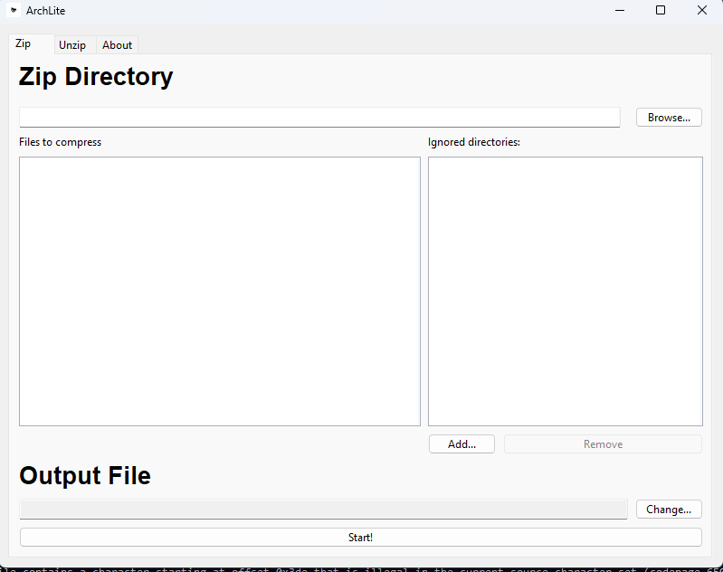
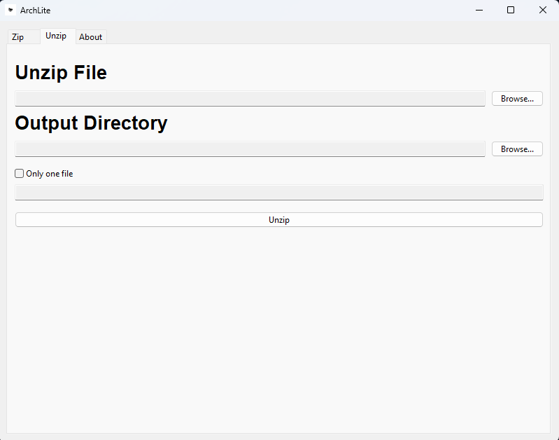
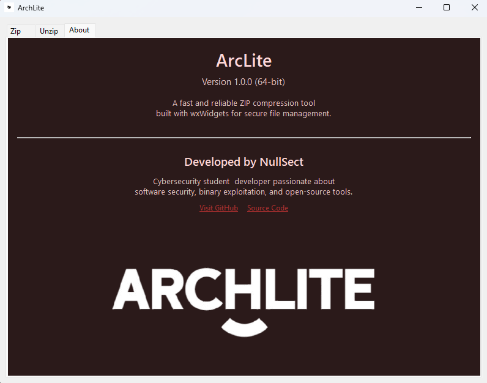

# ArcLite

**A fast, lightweight, and secure ZIP management tool built with wxWidgets**


---

### 📖 Overview

**ArcLite** is a desktop utility designed to simplify file compression and extraction.
Built with **C++ and wxWidgets**, it offers a modern interface, efficient performance,
and reliable ZIP handling without external dependencies.

Whether you're managing large archives or quickly extracting a single file,
ArcLite keeps the process **simple, fast, and secure**.

---

### ✨ Features

* **Zip Files and Folders** — Compress directories into `.zip` archives effortlessly.
* **Unzip Archives** — Extract all files or just a single one from any ZIP.
* **Safe and Reliable** — Built with robust file handling and error checking.
* **Fast Interface** — Powered by the native wxWidgets GUI toolkit.
* **Embedded Resources** — Custom icons and PNG graphics embedded directly into the binary.
* **Architecture Aware** — Automatically detects 32-bit or 64-bit builds.

---

### 🧰 Tech Stack

| Component           | Technology                                 |
| ------------------- | ------------------------------------------ |
| **Language**        | C++17                                      |
| **Framework**       | wxWidgets 3.x                              |
| **IDE**             | Visual Studio                              |
| **Compression**     | `wxZipInputStream` / `wxZipOutputStream`   |
| **Resource System** | Windows `.rc` with embedded icons and PNGs |

---

### 🖥️ How It Works

ArcLite provides three main tabs inside its main window:

1. **Zip** — Select a folder and compress it into a `.zip` file.
2. **Unzip** — Choose an archive to extract all or a single file from it.
3. **About** — View app details, version info, and developer links.

Each section uses native dialogs for file browsing and progress feedback.

---


### 📸 Screenshots

#### 🗜️ Zip Tab

<p align="center">
  
</p>

#### 📂 Unzip Tab

<p align="center">
  
</p>

#### ℹ️ About Tab

<p align="center">
  
</p>


---

### ⚙️ Installation

1. **Clone the repository**

   ```bash
   git clone https://github.com/bilalaniq/ArcLite.git
   ```
2. **Open in Visual Studio**

   * Make sure wxWidgets is properly configured.
3. **Build & Run**

   * Choose **x64** or **Win32** configuration.
   * Press **F5** to compile and launch ArcLite.

> 💡 Don’t forget to link against the appropriate wxWidgets libraries.

---

### 🧑‍💻 Developer

**Developed by:** [NullSect (Bilal Aniq)](https://github.com/bilalaniq)
**About Me:** Cybersecurity student & developer passionate about software security, binary exploitation, and open-source tools.

---

### 📜 License

This project is licensed under the **MIT License** — feel free to use, modify, or distribute it.

---

### 🌐 Links

* 🔗 [GitHub Profile](https://github.com/bilalaniq)
* 💾 [Source Code](https://github.com/bilalaniq/ArcLite)

---
